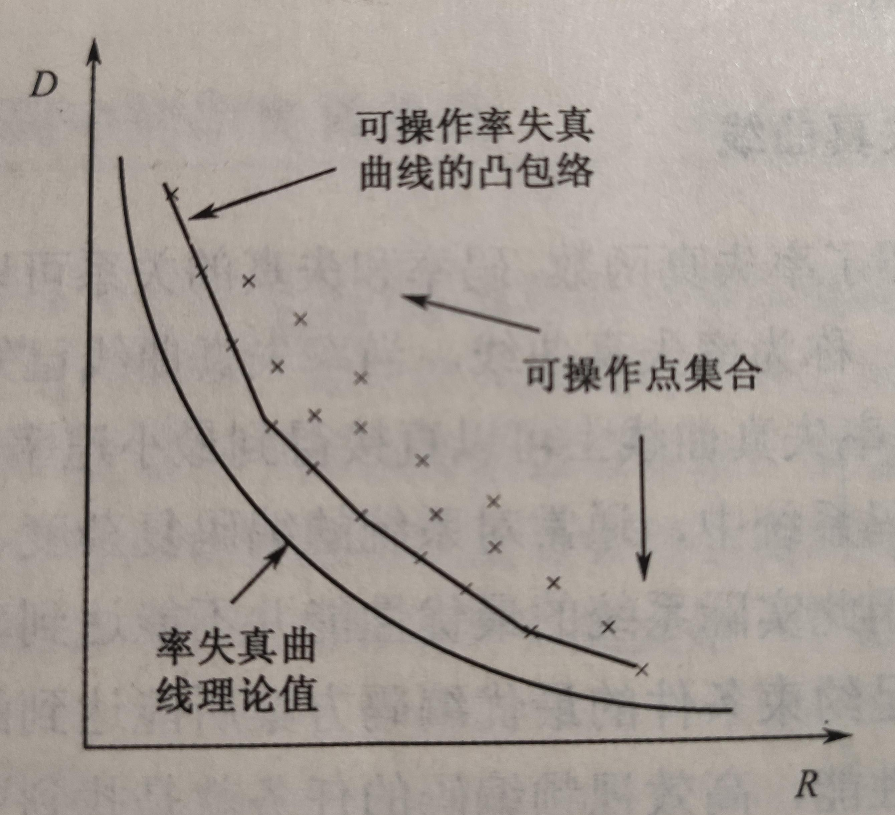
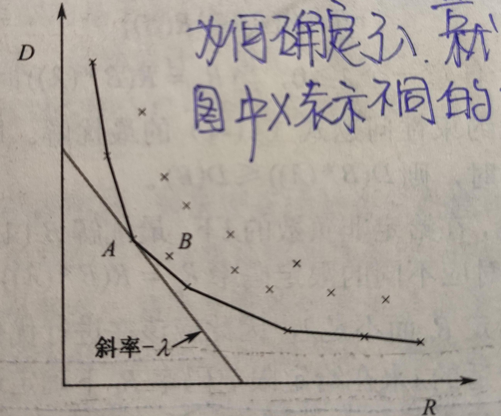

编码器的工作是对视频序列进行压缩。更具体的说，是把视频序列压缩到指定的码率下，并且在这个码率的限制下让视频有尽可能好的质量，或者说尽可能低的失真度。这里涉及到两个任务：

- 把视频序列压缩到指定的码率
- 在指定的码率下有尽可能低的失真度

这其实是编码器的两个重要的模块，**码率控制模块**和**模式决策模块**。一般来说，码率的高低会影响到编码图像的质量，编码模式的选择也会影响到码率输出，这两个是相互影响的过程。在编码参数中，qp是一个重要的参数，它直接影响了码率和编码质量。从这一点出发，再基于工程实践的简化考虑，编码器以这种方式解耦两个模块：**码率控制模块的输出是对宏块qp的设置，模式决策则是在给定宏块qp的条件下选择最优的编码模式**。

## RDO理论

模式选择从理论上来讲是一个优化过程，**在给定码率的条件下选择最优的编码方式，使得图像失真度最小**。用公式表述如下：
$$
min  D(p)\ s.t. R(p)<Rc
$$
D(p)代表图像的失真度，R(p)代表码率，Rc代表码率的限制。p是指编码参数，如每个宏块的qp，mode等等。显然，D和R都是p的函数。这是一个不等式约束的优化问题。根据拉格朗日乘子法和kkt条件，它可以转化成一个无约束的优化问题：
$$
min\ J=D(p)+\lambda*(R(p)-Rc)
$$
然而，这个公式很难直接的用到实际的编码过程中。D(p)和R(p)的关系很难确定，p有很多，难以确定量化关系。不过，对于一个实验视频序列，可以遍历所有的p，来得到不同p下的D和R。把他们绘制在R-D平面上，每一个点都代表一组可用的编码参数，这个编码参数对应的R-D值分别在R轴和D轴上。找到在不同的R的取值下的最小的D，这样就可以得到一个R-D曲线。在这条曲线上的点就是我们要找的最优的参数点，也成为操作点。

通过实验可以得到实际的R-D曲线，即为图中的包络线。而$\lambda$是乘子，当我们选择了一个Rc，找到了一个操作点。从理论上讲，$\lambda$是这个带点切线的斜率的负数。

对于公式：
$$
min\ J=D(p)+\lambda*(R(p)-Rc)
$$
它的极值点的条件是：
$$
\frac{\partial J}{\partial p}=\frac{\partial D}{\partial p}+\lambda*\frac{\partial R}{\partial p}=0\\
\frac{\partial J}{\partial \lambda}=R(p)-Rc=0\\
$$
第二个公式即为码率的约束，第一个公式等价与：
$$
\frac{\partial D}{\partial p} = -\lambda*\frac{\partial R}{\partial p}\\
=>\\
\frac{\partial D}{\partial R} = -\lambda
$$
因此，如果得到了某个序列的RD曲线，设定好Rc值之后可以得到$\lambda$ 参数

## RDO工程实践

但是上述方法很难用到实际的编码器中，RD曲线是未知的。编码过程中的参数量巨大，即使是离线情况下也很难得到RD曲线。在工程实践中，进行了如下的近似：

- 把全局最优近似成局部最优

  上述RD过程是全局的，从整体上来描述优化问题，即每个宏块的编码参数都在参数集合中。因此，在实际中的只对宏块层面进行RDO，并近似认为**每个宏块编码的最优解等价于整帧图像的最优解，等价于帧个序列的最优解**

- 把码率控制的和模式选择的任务尽可能解耦

  qp对图像质量和码率都有很大的影响，因此整个RDO的过程拆分为RC(码率控制)和MD(模式选择)两个模块，通过qp联系起来。对于每个宏块来说，确定了qp和mode(编码模式)就唯一确定了编码流程。因此，RDO的流程如下：RC通过码率控制算法确定每个宏块的qp，保证编码输出的码率限制在给定的范围。得到每个宏块的qp之后，通过最小化
  $$
  min\ J=D(mode)+\lambda*R(mode)
  $$
  得到编码模式。此时，只剩下了mode一个编码参数。

下面RDO过程最后一个问题，如何得到$\lambda$。实践中，通过测试来得到。在给定某个qp的条件下，同一个测试序列来改变$\lambda$。理论分析，$\lambda$越大，得到的最佳模式失真越大，编码输出的bits越小。$\lambda$越小，得到的最佳模式失真越小，编码输出的bits越大。可以认为这是一个权衡R与D的过程。那么，最佳的$\lambda$就是使用最小的bits的增加，来获得最大的图像质量的提升。

具体的方法是，给定一个qp参数，从0开始遍历$\lambda$的取值。确定一个图像质量评价的指标，可以使用psnr。随着$\lambda$的增加，psnr和size都在降低，记录每次$\lambda$变化pnsr和size的变化量，就能找到最佳的$\lambda$。这个过程和理论推导的公式也是一致的
$$
\frac{\partial D}{\partial R} = -\lambda
$$
即R-D图中，Rc点上的切线的斜率就是$\lambda$

可以看出，在宏块层面的模式选择，虽然用的是相似的拉格朗日公式，但是已经没有了码率的约束。这是因为码率的控制已经交给了RC模块，这里不需要关心，RC输出的qp是MD的输入参数。建立$\lambda = \lambda(qp)$的过程，就是寻找某个qp下最佳的$\lambda$，而通过这个$\lambda$最小化$D(mode)+\lambda(qp)*R(mode)$找到的是这个宏块“**效率**”最高的编码模式。这样就解决了RDO的工程化问题。

（猜测）如果$\lambda = \lambda(qp)$偏离了最佳值，不会影响码率控制的结果（如果码控算法有效），但是会影响图像质量。可以理解为模式选择没有有效地使用码率